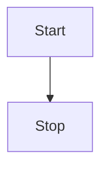

# 块级复制场景

触发前 caret 的落点参照段落。

## 正常表（渲染为 grid，可复制）

| 名称 | 值 |
| ---   | ---: |
| 甲 | 1 |
| 乙 | 22 |

    indented one
        deeper
    indented three
    indented four

```js
const alpha = 1;
  if (alpha) {
    beta();
  }
```

| a | b |
| --- | --- |
| one | two | three |
