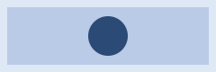

# 图片放大查看场景（M209 真机场景 33）

本文件是 lightbox（图片双击放大查看）的真机验收输入：三种引用形态各一张，双击任一张应打开遮罩。

固定尺寸 svg（240×80，固有尺寸明确）：

百分比宽度 svg（固有宽度不定：只声明 viewBox，按栏宽填充）：

小位图（96×32，真 PNG）：

场景断言只看**渲染终态**：上面三条引用在打开后都应是 ``（不是占位、不是加载中）。
