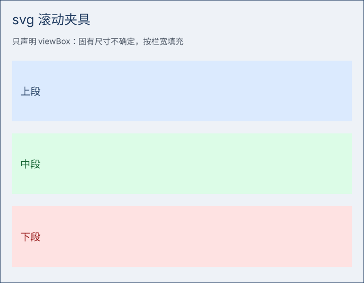

# svg 滚动场景

段落 01：这一行正文用来撑高度，倒序滚动要从它上面经过才看得到大图。

段落 02：这一行正文用来撑高度，倒序滚动要从它上面经过才看得到大图。

段落 03：这一行正文用来撑高度，倒序滚动要从它上面经过才看得到大图。

段落 04：这一行正文用来撑高度，倒序滚动要从它上面经过才看得到大图。

段落 05：这一行正文用来撑高度，倒序滚动要从它上面经过才看得到大图。

段落 06：这一行正文用来撑高度，倒序滚动要从它上面经过才看得到大图。

段落 07：这一行正文用来撑高度，倒序滚动要从它上面经过才看得到大图。

段落 08：这一行正文用来撑高度，倒序滚动要从它上面经过才看得到大图。

段落 09：这一行正文用来撑高度，倒序滚动要从它上面经过才看得到大图。

段落 10：这一行正文用来撑高度，倒序滚动要从它上面经过才看得到大图。

段落 11：这一行正文用来撑高度，倒序滚动要从它上面经过才看得到大图。

段落 12：这一行正文用来撑高度，倒序滚动要从它上面经过才看得到大图。

段落 13：这一行正文用来撑高度，倒序滚动要从它上面经过才看得到大图。

段落 14：这一行正文用来撑高度，倒序滚动要从它上面经过才看得到大图。

段落 15：这一行正文用来撑高度，倒序滚动要从它上面经过才看得到大图。

段落 16：这一行正文用来撑高度，倒序滚动要从它上面经过才看得到大图。

段落 17：这一行正文用来撑高度，倒序滚动要从它上面经过才看得到大图。

段落 18：这一行正文用来撑高度，倒序滚动要从它上面经过才看得到大图。

段落 19：这一行正文用来撑高度，倒序滚动要从它上面经过才看得到大图。

段落 20：这一行正文用来撑高度，倒序滚动要从它上面经过才看得到大图。

段落 21：这一行正文用来撑高度，倒序滚动要从它上面经过才看得到大图。

段落 22：这一行正文用来撑高度，倒序滚动要从它上面经过才看得到大图。

段落 23：这一行正文用来撑高度，倒序滚动要从它上面经过才看得到大图。

段落 24：这一行正文用来撑高度，倒序滚动要从它上面经过才看得到大图。

段落 25：这一行正文用来撑高度，倒序滚动要从它上面经过才看得到大图。

段落 26：这一行正文用来撑高度，倒序滚动要从它上面经过才看得到大图。

段落 27：这一行正文用来撑高度，倒序滚动要从它上面经过才看得到大图。

段落 28：这一行正文用来撑高度，倒序滚动要从它上面经过才看得到大图。

段落 29：这一行正文用来撑高度，倒序滚动要从它上面经过才看得到大图。

段落 30：这一行正文用来撑高度，倒序滚动要从它上面经过才看得到大图。

段落 31：这一行正文用来撑高度，倒序滚动要从它上面经过才看得到大图。

段落 32：这一行正文用来撑高度，倒序滚动要从它上面经过才看得到大图。

段落 33：这一行正文用来撑高度，倒序滚动要从它上面经过才看得到大图。

段落 34：这一行正文用来撑高度，倒序滚动要从它上面经过才看得到大图。

段落 35：这一行正文用来撑高度，倒序滚动要从它上面经过才看得到大图。

段落 36：这一行正文用来撑高度，倒序滚动要从它上面经过才看得到大图。

段落 37：这一行正文用来撑高度，倒序滚动要从它上面经过才看得到大图。

段落 38：这一行正文用来撑高度，倒序滚动要从它上面经过才看得到大图。

段落 39：这一行正文用来撑高度，倒序滚动要从它上面经过才看得到大图。

段落 40：这一行正文用来撑高度，倒序滚动要从它上面经过才看得到大图。

段落 41：这一行正文用来撑高度，倒序滚动要从它上面经过才看得到大图。

段落 42：这一行正文用来撑高度，倒序滚动要从它上面经过才看得到大图。

段落 43：这一行正文用来撑高度，倒序滚动要从它上面经过才看得到大图。

段落 44：这一行正文用来撑高度，倒序滚动要从它上面经过才看得到大图。

段落 45：这一行正文用来撑高度，倒序滚动要从它上面经过才看得到大图。

段落 46：这一行正文用来撑高度，倒序滚动要从它上面经过才看得到大图。

段落 47：这一行正文用来撑高度，倒序滚动要从它上面经过才看得到大图。

段落 48：这一行正文用来撑高度，倒序滚动要从它上面经过才看得到大图。

段落 49：这一行正文用来撑高度，倒序滚动要从它上面经过才看得到大图。

段落 50：这一行正文用来撑高度，倒序滚动要从它上面经过才看得到大图。

段落 51：这一行正文用来撑高度，倒序滚动要从它上面经过才看得到大图。

段落 52：这一行正文用来撑高度，倒序滚动要从它上面经过才看得到大图。
