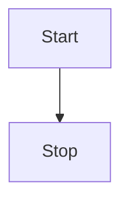

# 块级复制场景

触发前 caret 的落点参照段落。

## 正常表（渲染为 grid，可复制）

| 名称 | 值 |
| ---   | ---: |
| 甲 | 1 |
| 乙 | 22 |

## 非矩形表（整块回退，无 grid DOM，没有钮）

| a | b |
| --- | --- |
| one | two | three |

## 围栏代码块（语言标记 + 内容相对缩进）

```js
const a = 1;
  if (a) {
    console.log(a);
  }
```

## 缩进代码块（比语法缩进更深一行）

    indented one
        deeper

## mermaid 围栏块（图表态没有钮）


